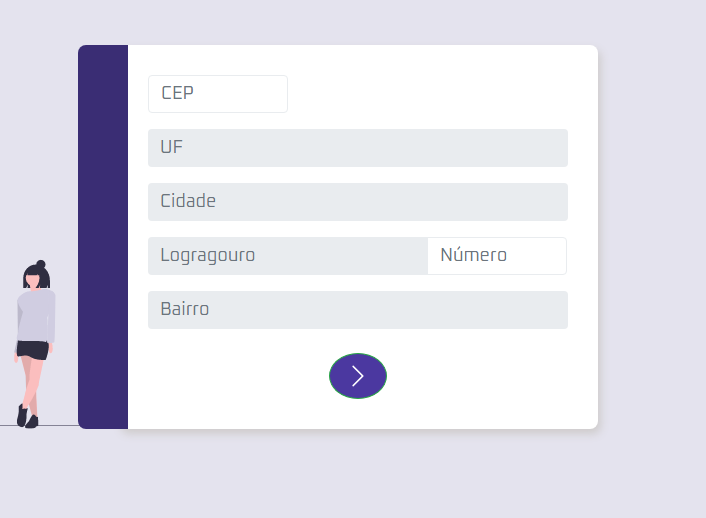

<h1 align="center">
    
</h1>
<h1 align="center">
    <br>
    BUSCA CEP
</h1>

<h4 align="center">Api para consulta de cep e trazer as informações preenchendo automático os campos do formulário.</h4>


## :white_check_mark: Features

* Possibilidade de consulta de CEP'S
* Layout construído com HTML E CSS

## :globe_with_meridians: Tecnologias

Esse projeto foi desenvolvido usando as seguintes tecnologias:

-  [HTML5](https://developer.mozilla.org/pt-BR/docs/Web/HTML/HTML5)
-  [CSS3](https://developer.mozilla.org/pt-BR/docs/Archive/CSS3)
-  [Javascript](https://developer.mozilla.org/pt-BR/docs/Aprender/JavaScript)

## :wrench: Como Utilizar

Clone essa aplicação utilizando o [Git](https://git-scm.com) e utilizando os seguintes comandos:

```bash
# Clonando esse repositório
$ git clone https://github.com/http-otavio/BuscaCep
```
Em seguida execute o arquivo 'index.html' no seu navegador


## :memo: Licença 
This project is under the MIT license. See the [LICENSE](https://github.com/lukemorales/react-native-design-code/blob/master/LICENSE) for more information.

## Autor

| [<br><sub>Otávio Messias</sub>](https://github.com/http-otavio) |
| :---: |
|[Linkedin](www.linkedin.com/in/otávio-messias)|